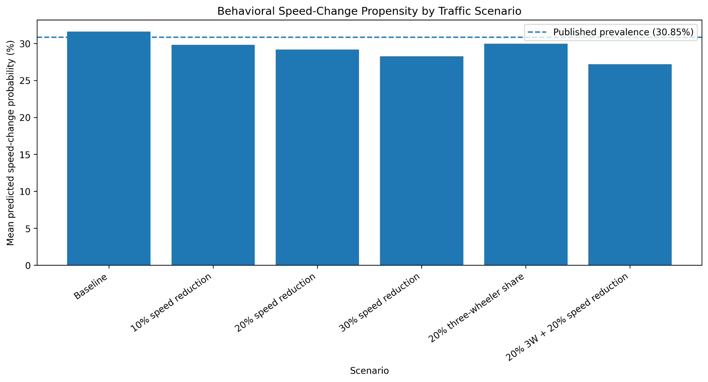
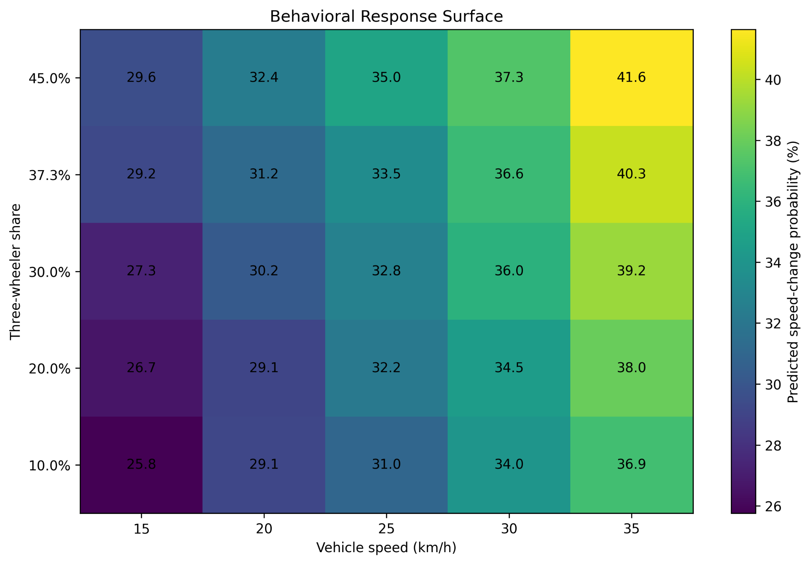
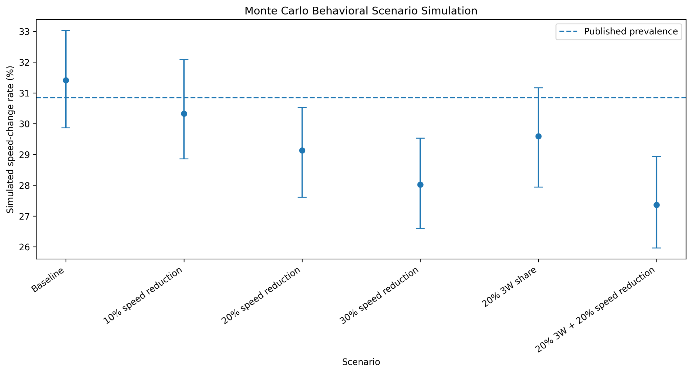

# Pedestrian Behavior: Behavior-Informed Stochastic Simulation

This repository contains a reproducible Python workflow for examining **pedestrian crossing speed-change behavior under mixed traffic** using a literature-derived logistic model, a synthetic pedestrian population, counterfactual traffic scenarios, Monte Carlo simulation, and one-at-a-time sensitivity analysis.

> **Important:** this is a **synthetic behavioral simulation**. It is not the original pedestrian-level dataset, not a reconstruction of the original SPSS analysis, not PTV Vissim, and not a causal model.

## What the repository contains

- `pedestrian_behavior_simulation_corrected.py` — complete simulation and plotting script.
- `requirements.txt` — Python dependencies.
- `run_windows.bat` — one-click Windows runner.
- `run_mac_linux.sh` — macOS/Linux runner.
- `verify_outputs.py` — checks that the expected result files are present.
- `pedestrian_behavior_simulation_outputs/` — generated CSV tables and figures included with this repository.
- `docs/Pedestrian_behavior_sensitivity_analysis.docx` — supporting analysis document.

## Analysis workflow

The script performs the following steps:

1. Normalizes reported categorical probabilities so they sum to 1.
2. Checks published beta coefficients against reported odds ratios using `exp(beta)`.
3. Generates a synthetic population of **3,209 pedestrians** from reported marginal distributions and explicit assumptions for continuous variables.
4. Encodes the published logistic-model predictors.
5. Calibrates an **illustrative intercept** to the reported speed-change prevalence of **30.85%**.
6. Simulates a baseline binary speed-change outcome.
7. Evaluates traffic scenarios involving vehicle-speed reduction and three-wheeler share.
8. Builds vehicle-speed and three-wheeler response curves and a two-factor response surface.
9. Runs Monte Carlo scenario simulations and reports empirical 95% intervals.
10. Performs sensitivity analysis for vehicle speed, vehicle gap, waiting time, pedestrian speed, and vehicles encountered.

## Key assumptions and limitations

- The original 3,209 pedestrian-level observations are unavailable.
- The original logistic-model intercept is unavailable; an illustrative prevalence-calibrated intercept is used.
- Several continuous-variable means/distributions are assumed because complete distributions were not available.
- Path change is generated from its reported marginal prevalence rather than reconstructed from original correlations.
- The script uses reported beta coefficients for logistic prediction. A reported inconsistency exists for the elder category: `beta = +0.120` implies `exp(beta) ≈ 1.127`, while the reported odds ratio is `0.872`.
- Results should be described as **literature-derived stochastic scenario/sensitivity results**, not causal effects.

## Quick start

### Option A — Windows

1. Install Python 3.10 or newer.
2. Download or clone this repository.
3. Double-click `run_windows.bat`.

The batch file installs the required packages and runs the full analysis.

### Option B — Command line

```bash
python -m pip install -r requirements.txt
python pedestrian_behavior_simulation_corrected.py
```

On macOS/Linux, you may need `python3` instead of `python`.

The complete Monte Carlo section performs many repeated simulations, so the full run can take several minutes depending on the computer.

## Reproducibility

The code uses fixed random seeds. The main baseline synthetic population is generated with `seed=42`, and scenario/Monte Carlo routines also use deterministic seeds. This makes repeated runs reproducible for the same software stack.

To verify that the expected files exist after a run:

```bash
python verify_outputs.py
```

## Main outputs

### Scenario comparison



### Behavioral response surface



### Monte Carlo scenario simulation



## Output tables

| File | Purpose |
|---|---|
| `synthetic_pedestrian_population.csv` | Synthetic individual-level population and simulated outcome |
| `beta_or_check.csv` | Beta-versus-reported-odds-ratio consistency check |
| `scenario_results.csv` | Traffic scenario results |
| `monte_carlo_results.csv` | Monte Carlo means, SDs, empirical 95% intervals, minima and maxima |
| `sensitivity_results.csv` | One-at-a-time sensitivity results |
| `behavioral_response_surface.csv` | Vehicle-speed × three-wheeler-share response surface |

## Figures

The output folder includes:

- scenario comparison;
- vehicle-speed response;
- three-wheeler-share response;
- behavioral response surface;
- Monte Carlo scenario intervals; and
- sensitivity plots for vehicle speed, vehicle gap, waiting time, pedestrian speed, and vehicles encountered.

## Recommended wording when presenting the method

> A literature-derived stochastic behavioral simulation was developed using published logistic-regression coefficients and reported marginal distributions to examine counterfactual traffic scenarios.

## Before making the repository public

Add the full bibliographic citation/DOI of the source paper from which the published coefficients and marginal distributions were taken. Also review the supporting Word document for any information you do not want to make public.

## Automated reproducibility check

This repository includes a GitHub Actions workflow at `.github/workflows/ci.yml`. On every push or pull request it installs the Python dependencies, runs the complete simulation, verifies the expected CSV/PNG outputs, and uploads the generated output folder as a workflow artifact. It can also be started manually from **Actions → Reproducibility check → Run workflow**.
